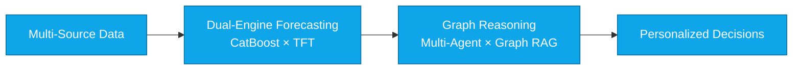
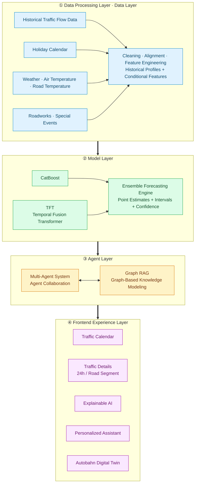
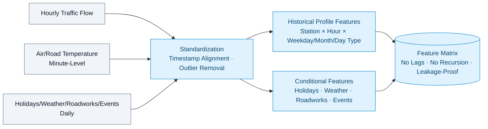
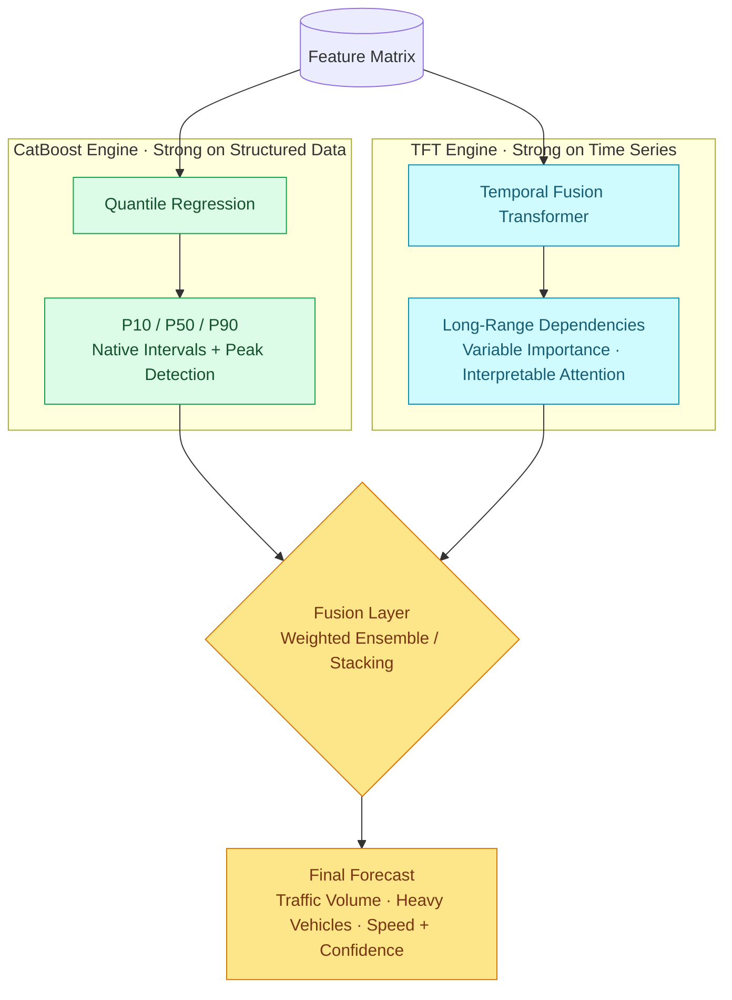
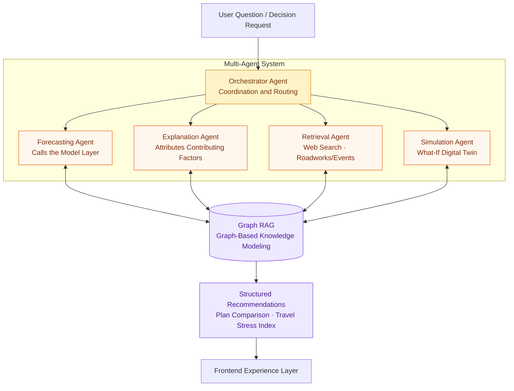
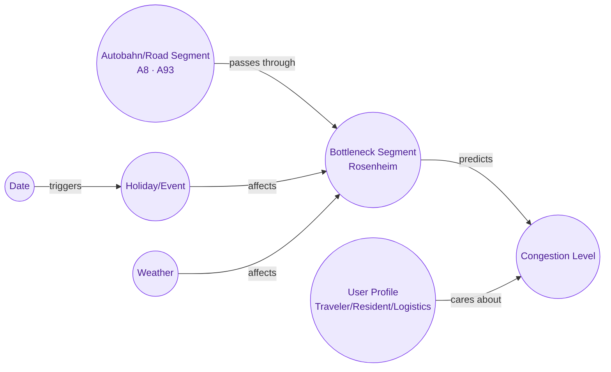
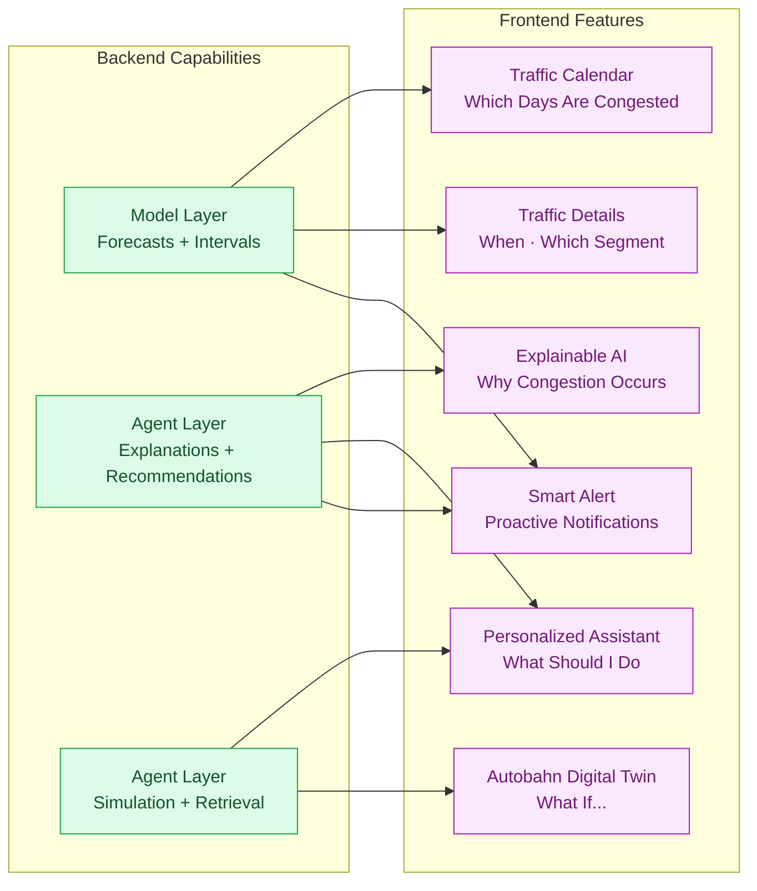
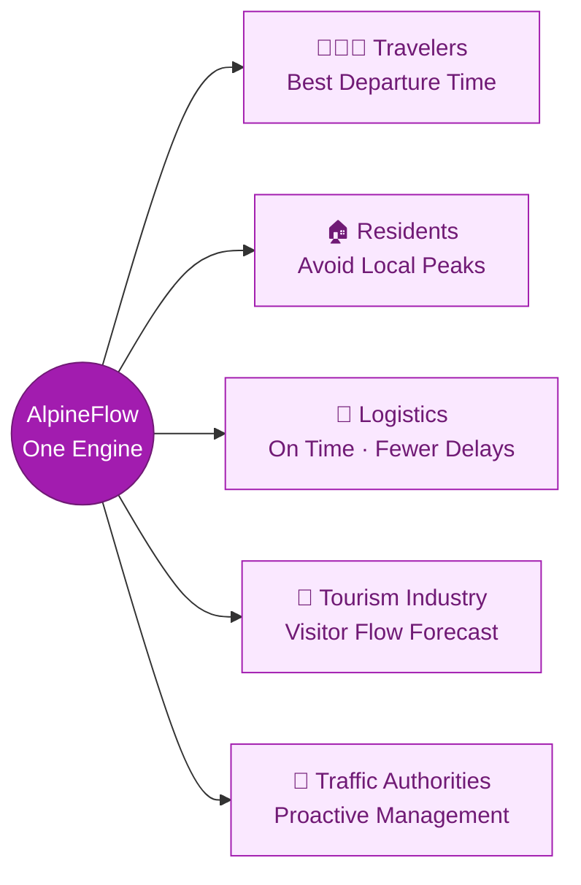

# AlpineFlow AI · Project Architecture and Product Plan

> **From Traffic Forecasting to Traffic Decision-Making**
> An end-to-end Autobahn traffic intelligence platform spanning data, models, agents, and user experience.

### Our Goals

1. **Human Mobility Intelligence** — Understand why people travel and predict future demand.
2. **Traffic Digital Twin** — Simulate what will happen with a digital twin and test solutions in advance.
3. **Multi-Agent Optimization** — Let AI decide how each person should travel while optimizing the entire transportation ecosystem.

---

## 1. Four-Layer Architecture Overview

The entire system consists of four vertically integrated layers. Each layer provides capabilities to the one above it, ultimately turning them into decisions for different users in the frontend.

---

## 2. Data Processing Layer

Transform raw data from multiple heterogeneous sources and time granularities into features that models can consume directly.

- **Historical profiles**: Condense the primary traffic flows from 2023–2025 into typical profiles that serve as the forecasting baseline.
- **Conditional shifts**: Holidays, weather, roadworks, and events only adjust the baseline, making their effects explainable and attributable.

---

## 3. Model Layer (CatBoost × TFT Dual Engine)

We use a dual-engine ensemble of **gradient-boosted trees and a temporal Transformer**, combining strong structured-feature representation with long-range temporal dependencies.

| Engine | Strengths | Outputs |
|---|---|---|
| **CatBoost** | Categorical features, sparse events, and quantile intervals | P10/P50/P90 forecasts + peak-hour detection |
| **TFT** | Long-range time series and multivariable attention | Temporal trends + variable-level interpretability |
| **Fusion Layer** | Combines complementary strengths | More stable point estimates + more reliable uncertainty |

> The dual-engine architecture not only improves accuracy but also provides both **intervals (CatBoost)** and **attention-based attribution (TFT)**, laying the foundation for explainable AI in the upper layers.

---

## 4. Agent Layer (Multi-Agent × Graph RAG)

The **multi-agent system** collaborates on decision-making, while a **graph database (Graph RAG)** models roads, events, forecasts, and users as a knowledge graph. This enables AI agents to learn Autobahn traffic patterns from real-world data.

**Graph RAG knowledge modeling** — Represent the transportation world as a graph that supports reasoning:

- **Multi-Agent**: Coordination, forecasting, explanation, retrieval, and simulation agents each have distinct responsibilities and work together to generate well-reasoned plans.
- **Graph RAG**: Graph relationships capture why congestion occurs, where it occurs, and who is affected, making recommendations traceable and explainable.

---

## 5. Frontend Experience Layer · Tied to the Architecture

The frontend is not an isolated UI—**every product feature directly uses capabilities from a specific architectural layer**, creating a strong architecture-to-experience connection.

**Five user groups, one architecture, different decisions**:

### Product Features

**1. Traffic Calendar** — Answers: Which days will be congested?

- Select an Autobahn, direction, and date.
- Calendar colors show future congestion risk: 🟢 Smooth → 🔴 Critical.

**2. Traffic Detail** — Answers: When and where will congestion occur?

- **Daily Forecast**: Daily congestion level / estimated traffic volume / forecast confidence.
- **24h Traffic Prediction**: Hourly congestion / peak congestion time / recommended departure time.
- **Segment Map**: Displays congestion across different Autobahn segments and identifies bottleneck areas.

**3. Explainable AI** — Answers: Why will congestion occur?

- Analyzes contributing factors such as holidays, weekend travel, and historically similar dates.
- Makes forecasts trustworthy.

**4. Personalized Assistant (AI Agent)** — Answers: What should I do?

- Forecasting model + web search for roadworks and scheduled events.
- Generates recommendations, travel-plan comparisons, and a Travel Stress Index for different users:
  - 👨‍👩‍👧 Traveler → Recommend the best departure date and time.
  - 🏠 Resident → Avoid local traffic disruption.
  - 🚚 Logistics → Optimize transportation schedules and reduce delays.
  - 🏨 Tourism → Forecast visitor peaks and adjust operations.
  - 🚦 Authority → Prepare traffic-management measures and issue guidance in advance.
- Plans must be complete and include predicted travel time starting from departure in Munich.
- Users can save a plan and enable Traffic Impact Notifications. If weather or other factors later affect the trip, the system automatically generates a new plan.

**5. Autobahn Digital Twin (AI Traffic Digital Twin + What-If Simulation)** — Simulates future traffic conditions in real time.

- Users can ask questions directly, such as, “Can I still travel if it rains tomorrow?”
- AI provides a recommendation, reasons with a traffic simulation visualization, and alternative plans.

**6. Smart Alert** — Proactive notifications.

- Better travel windows / changes in delay risk / high-risk traffic days.

**7. Feedback**

- After a trip, users can review and rate that day’s traffic conditions, allowing the model to adjust dynamically based on confidence.

---

### Future Plan

**1. AI Traffic Digital Twin (Autobahn Digital Twin)** — Focused on technical innovation.

- Create a virtual A8 Autobahn: `Real A8 → AI Model → Virtual A8`.
- Simulate: `+20% tourists` / `+heavy rain` / `+accident`.
- Result: `Rosenheim bottleneck appears at 09:30. Queue length: 8 km`.
- Suitable for traffic authorities and hackathon pitches.

**2. Traffic Memory (Personal Traffic Memory)** — AI learns user habits.

- Previously: `You always drive Munich → Salzburg on Friday evening`.
- Future proactive alert: `Your usual trip next Friday will face a 45-minute delay. Leave 2 hours earlier?`

**3. Traffic Crowd Forecast (When Will Others Leave?)** — Users want to know when everyone else is leaving so they can avoid the crowd.

- Display: `People like you: 45% leave between 08:00–10:00 🔴 / 15% leave before 06:00 🟢`.
- Then recommend: `Beat the crowd: Leave at 05:45`.
- Community: Users submit their planned travel times. Aggregated results help others travel outside peak periods.

---
