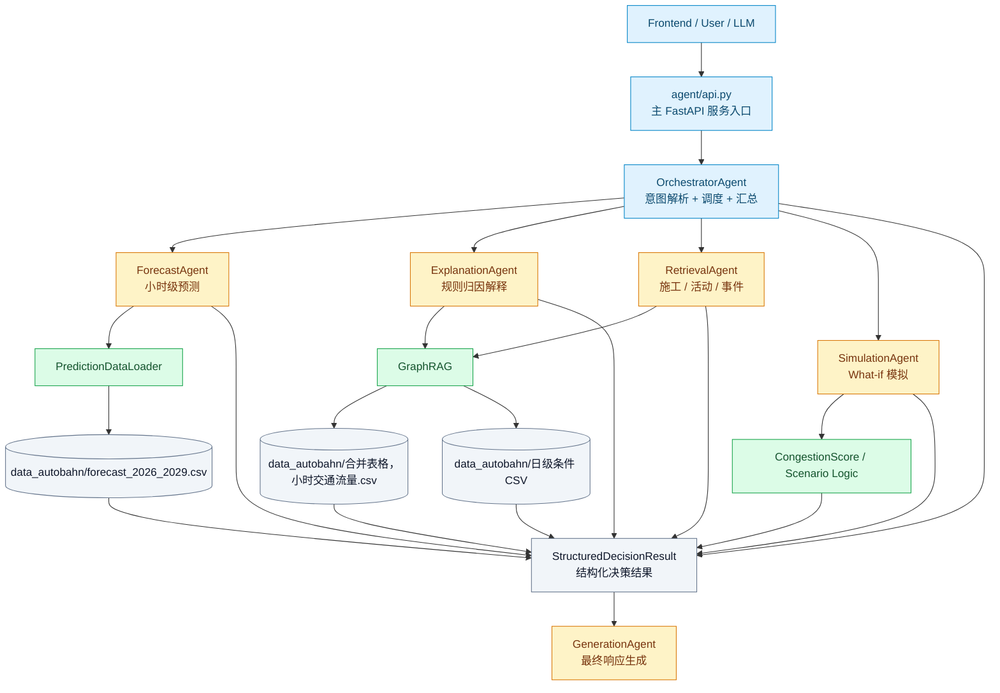
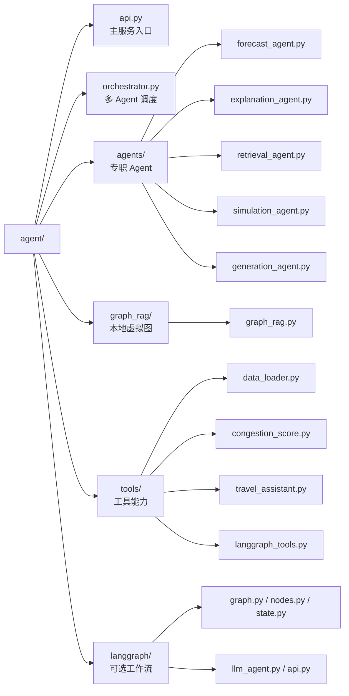
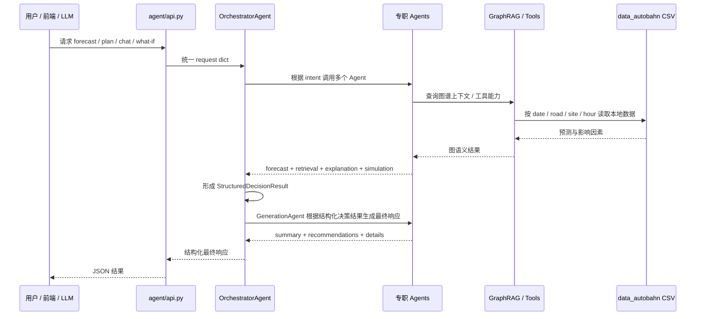
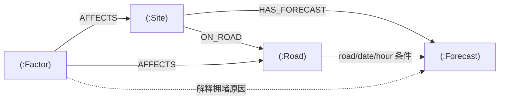
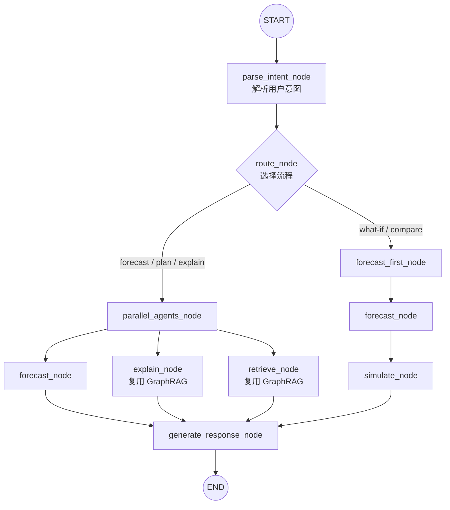
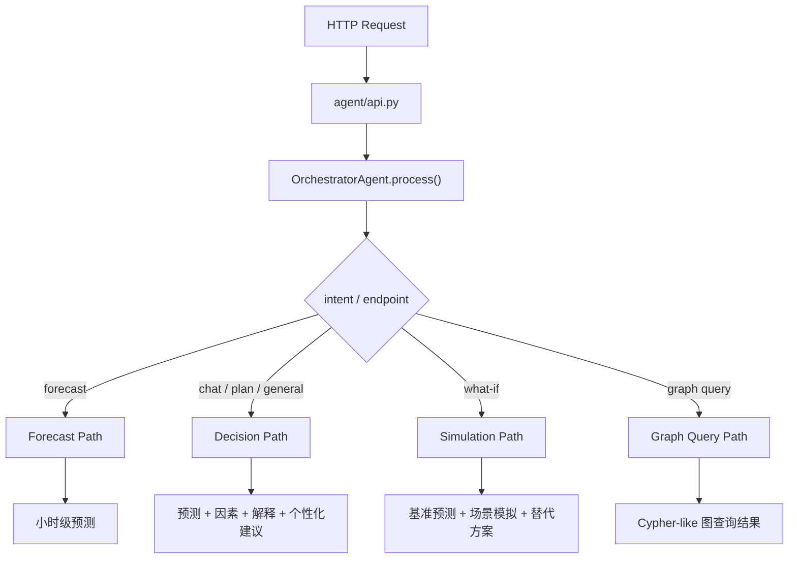
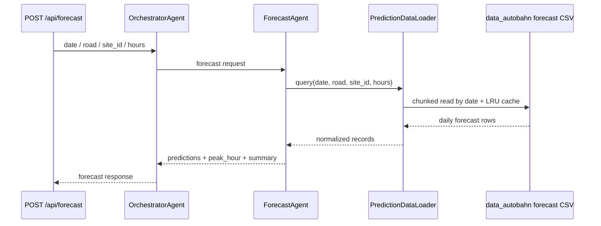
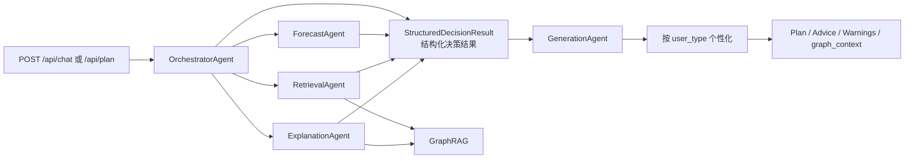
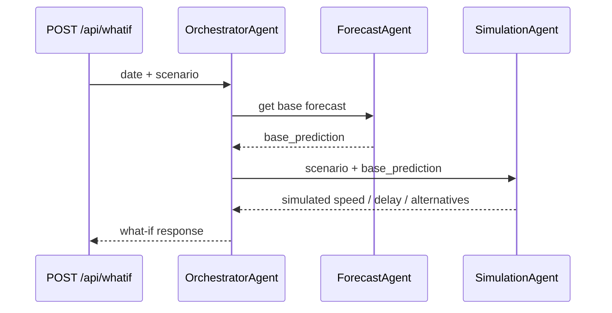
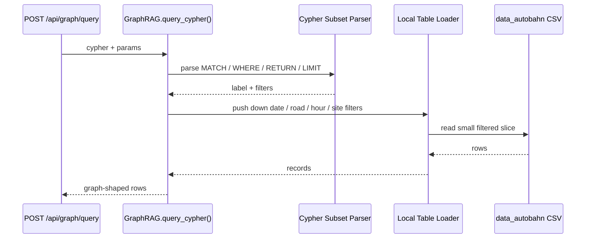

# AlpineFlow AI Agent 层架构说明

`agent/` 是 AlpineFlow AI 的智能体层，负责把已经生成好的交通预测数据、站点信息、天气/施工等外部因素，组织成可以被前端、API、LLM 和 Graph RAG 调用的决策能力。

这一层的定位不是重新训练模型，而是把「预测结果」转化为「可解释、可查询、可规划、可模拟」的交通决策服务。

---

## 1. 总体架构

当前 Agent 层由五个专职 Agent 加一个底层 GraphRAG 能力组成：



更具体地说：



主路径是：



---

## 2. 为什么这样设计

项目的底层预测和解释条件数据统一来自 `data_autobahn/` 目录，例如：

- `data_autobahn/forecast_2026_2029.csv`
- `data_autobahn/合并表格，小时交通流量.csv`
- `data_autobahn/合并表格，weather日级.csv`
- `data_autobahn/合并表格，construction日级.csv`
- `data_autobahn/合并表格，holiday日级.csv`
- `data_autobahn/合并表格，special_events日级.csv`

所以 Agent 层的重点不是实时跑模型，而是：

1. 快速查询预测结果。
2. 解释某一天、某个小时、某条路为什么风险高。
3. 把预测、天气、施工、节假日等因素组合起来。
4. 为不同用户生成不同建议。
5. 支持 LLM 或前端用统一接口调用这些能力。

因此当前采用的是「本地表数据 + 虚拟图查询 + 多 Agent 调度」的架构。

---

## 3. 目录结构说明

```text
agent/
├── api.py
├── orchestrator.py
├── base.py
├── config.py
├── example.py
├── README.md
├── requirements.txt
│
├── agents/
│   ├── forecast_agent.py
│   ├── explanation_agent.py
│   ├── retrieval_agent.py
│   ├── simulation_agent.py
│   └── generation_agent.py
│
├── graph_rag/
│   ├── __init__.py
│   └── graph_rag.py
│
├── tools/
│   ├── __init__.py
│   ├── data_loader.py
│   ├── congestion_score.py
│   ├── travel_assistant.py
│   └── langgraph_tools.py
│
└── langgraph/
    ├── __init__.py
    ├── api.py
    ├── example.py
    ├── graph.py
    ├── llm_agent.py
    ├── nodes.py
    ├── state.py
    └── subagent.md
```

### 根目录文件

| 文件 | 作用 |
|---|---|
| `api.py` | 主 FastAPI 服务入口，推荐前端或演示使用这个 API |
| `orchestrator.py` | 多 Agent 调度器，负责解析意图、调用不同 Agent、汇总结果 |
| `base.py` | Agent 基类、Agent 类型枚举、统一响应格式 |
| `config.py` | Agent 配置，如模型目录、GraphRAG 后端类型等 |
| `example.py` | 主 Agent 系统的运行示例 |
| `requirements.txt` | Agent 层依赖 |
| `README.md` | 当前说明文档 |

---

## 4. agents/：专职 Agent 层

`agents/` 里每个文件代表一个专职 Agent。它们都围绕 `BaseAgent` 的统一接口工作：

```python
async def initialize(self) -> bool
async def process(self, request: Dict[str, Any]) -> AgentResponse
```

### ForecastAgent

位置：`agents/forecast_agent.py`

职责：读取交通预测结果。

当前优先使用：

```text
data_autobahn/forecast_2026_2029.csv
```

输出包括：

- 每小时预测流量 `p10 / p50 / p90`
- 平均车速 `v_kfz`
- 重型车流量 `sv_h`
- 拥堵等级
- 峰值小时
- 日度汇总

如果 `data_autobahn` 预测 CSV 查不到对应记录，才会 fallback 到模型或 mock 逻辑。

### ExplanationAgent

位置：`agents/explanation_agent.py`

职责：解释交通风险来源。

它主要做规则型归因，例如：

- 是否公共假期
- 是否学校假期
- 是否周五/周日出行高峰
- 是否旅游季
- 是否有天气影响
- 是否经过瓶颈路段
- GraphRAG 提供的天气、施工、节假日、活动和预测上下文

它适合给前端展示「为什么堵」。

### RetrievalAgent

位置：`agents/retrieval_agent.py`

职责：检索或整理外部因素。

当前包含：

- 施工信息
- 特殊活动
- 事故/事件占位
- GraphRAG 图谱因素与用户相关上下文
- 外部因素 warning

之后如果要接真实 API，例如 Autobahn 施工 API、活动 API、天气 API，可以优先扩展这个 Agent。

### SimulationAgent

位置：`agents/simulation_agent.py`

职责：What-if 场景模拟。

支持场景包括：

- 天气变化，例如暴雨、雪、结冰
- 流量增加，例如游客增加 20%
- 事故，例如封闭车道
- 施工，例如减少通行能力

输出包括：

- 模拟后的车速
- 延误分钟数
- 拥堵等级变化
- 替代方案
- 出行建议

### GenerationAgent

位置：`agents/generation_agent.py`

职责：把 Orchestrator 收集到的结构化结果汇总成最终响应。

它不直接查询底层数据，也不直接拼 raw agent outputs，而是消费 Orchestrator 生成的 `structured_decision_result` 节点：

| 输入 | 作用 |
|---|---|
| `forecast` | 提取峰值小时、拥堵等级和日度摘要 |
| `external_factors` | 汇总施工、活动、事故和 GraphRAG 因素 warning |
| `explanation` | 汇总规则归因和 GraphRAG 解释上下文 |
| `simulation` | 汇总 What-if 场景影响 |
| `plan` | 生成出发时间、到达时间和个性化建议 |

最终输出保留 `details` 里的结构化决策结果，同时提供 `summary`、`key_findings` 和 `recommendations` 给前端或 LLM 使用。

---

## 5. graph_rag/：本地 Graph RAG 层

位置：`graph_rag/graph_rag.py`

这是当前 Agent 层最核心的新增能力。

### 它不是 Neo4j

当前 Graph RAG 不依赖 Neo4j，也不会启动外部图数据库服务。

它是一个「本地表驱动的虚拟图」：

```mermaid
flowchart LR
    SITE_META[("data_autobahn/合并表格，小时交通流量.csv")] --> SITE["Site 节点"]
    SITE_META --> ROAD["Road 节点"]

    FORECAST[("data_autobahn/forecast_2026_2029.csv")] --> FORECAST_NODE["Forecast 节点<br/>按 date 懒加载"]

    WEATHER[("data_autobahn/合并表格，weather日级.csv")] --> WEATHER_FACTOR["Weather Factor"]
    CONSTRUCTION[("data_autobahn/合并表格，construction日级.csv")] --> CONSTRUCTION_FACTOR["Construction Factor"]
    HOLIDAY[("data_autobahn/合并表格，holiday日级.csv")] --> HOLIDAY_FACTOR["Holiday Factor"]
    EVENT[("data_autobahn/合并表格，special_events日级.csv")] --> EVENT_FACTOR["Event Factor"]
    CALENDAR["日期 / 周末 / 旅游季规则"] --> CALENDAR_FACTOR["Calendar Factor"]

    WEATHER_FACTOR --> FACTOR["Factor 节点"]
    CONSTRUCTION_FACTOR --> FACTOR
    HOLIDAY_FACTOR --> FACTOR
    EVENT_FACTOR --> FACTOR
    CALENDAR_FACTOR --> FACTOR

    SITE --> GRAPH["本地虚拟 GraphRAG"]
    ROAD --> GRAPH
    FORECAST_NODE --> GRAPH
    FACTOR --> GRAPH

    classDef file fill:#f1f5f9,stroke:#64748b,color:#0f172a;
    classDef node fill:#e0f2fe,stroke:#0284c7,color:#0c4a6e;
    classDef factor fill:#fef3c7,stroke:#d97706,color:#78350f;
    classDef graph fill:#dcfce7,stroke:#16a34a,color:#14532d;
    class SITE_META,FORECAST,WEATHER,CONSTRUCTION,HOLIDAY,EVENT file;
    class SITE,ROAD,FORECAST_NODE node;
    class WEATHER_FACTOR,CONSTRUCTION_FACTOR,HOLIDAY_FACTOR,EVENT_FACTOR,CALENDAR_FACTOR,FACTOR factor;
    class GRAPH graph;
```

### 为什么不把所有预测行都建成图节点

`forecast_2026_2029.csv` 有几十万行。如果把每一行都常驻成图节点，会浪费内存，而且查询性能未必更好。

当前设计是：

1. 小表常驻内存：站点、道路、天气气候基准、施工表。
2. 大表懒加载：预测数据必须带 `date` 查询。
3. 查询时先按 `date` 分块扫描 CSV，再用 `road / site_id / hour` 过滤。
4. 最近查询过的日期会进入 LRU 缓存，连续追问同一天时不重复扫大表。
4. 返回结果时再包装成图语义节点。

这样既能像图一样查询，又保持表查询的性能。

### 支持的虚拟节点

| Label | 含义 | 来源 |
|---|---|---|
| `Road` | 高速路，例如 A8 / A93 | 小时交通流量 CSV 派生 |
| `Site` | 测量站点 | 小时交通流量 CSV |
| `Forecast` | 小时级预测记录 | `forecast_2026_2029.csv` |
| `Factor` | 影响因素 | 天气、施工、假期、活动、日历规则 |

### 支持的关系语义

这些关系不是物理存储的边，而是查询时动态表达的语义：



### Cypher-like 查询示例

查询 A8 某天某几个小时的预测：

```cypher
MATCH (f:Forecast)
WHERE f.date = $date AND f.road = $road AND f.hour IN $hours
RETURN f.hour AS hour, f.kfz_h_p50 AS flow, f.v_kfz_p50 AS speed
ORDER BY f.hour
LIMIT 24
```

对应 Python 调用：

```python
rows = graph.query_cypher(
    """
    MATCH (f:Forecast)
    WHERE f.date = $date AND f.road = $road AND f.hour IN $hours
    RETURN f.hour AS hour, f.kfz_h_p50 AS flow, f.v_kfz_p50 AS speed
    ORDER BY f.hour
    LIMIT 24
    """,
    {"date": "2026-08-01", "road": "A8", "hours": [8, 9, 10]},
)
```

性能规则：查询 `Forecast` 时必须包含 `date`。这是为了让 CSV 分块读取只缓存并处理单日预测数据，避免每次请求都把完整预测表常驻内存。

---

## 6. tools/：工具层

`tools/` 存放可复用的工具函数和数据能力，不直接负责调度。

### data_loader.py

职责：加载和查询数据。

主要类：

| 类 | 作用 |
|---|---|
| `PredictionDataLoader` | 查询 `data_autobahn/forecast_2026_2029.csv` 预测结果 |
| `ExternalDataLoader` | 加载 `data_autobahn` 里的天气、假期、施工、活动等条件数据 |

关键点：

- 默认读取 `data_autobahn/forecast_2026_2029.csv`
- 对预测 CSV 按日期分块读取，不一次性载入全部预测行
- 自动把 `sv_h_pred` 映射为 `sv_h_p50`
- 自动把 `v_kfz_pred` 映射为 `v_kfz_p50`
- 内置按日期的 LRU 缓存

### congestion_score.py

职责：计算拥堵分数和拥堵等级。

输入包括：

- 总车流量 `kfz_h`
- 重型车流量 `sv_h`
- 平均速度 `v_kfz`
- 道路容量
- 外部因素，例如周末、假期、施工、天气

输出包括：

- 拥堵总分
- 拥堵等级
- 颜色标记
- 分项贡献

### travel_assistant.py

职责：更高层的出行助手逻辑。

它可以基于预测数据生成：

- 出发时间建议
- 多个方案对比
- 出行压力指数
- 针对游客、居民、物流、旅游业、交通部门的个性化建议

这部分适合后续和前端「Personalized Assistant」功能对接。

### langgraph_tools.py

职责：提供给 LLM / LangGraph tool-calling 使用的工具函数。

包括：

- `get_traffic_forecast`
- `get_events`
- `get_construction_info`
- `simulate_scenario`
- `get_best_departure_time`
- `query_traffic_graph`

其中 `query_traffic_graph` 会调用同一个本地 `GraphRAG`。

---

## 7. langgraph/：可选工作流层

`langgraph/` 是可选的工作流实现，不是主 API 的唯一入口。

它适合做：

- 多节点工作流演示
- LLM tool-calling
- 带状态的对话流程
- 可视化工作流图

核心文件：

| 文件 | 作用 |
|---|---|
| `state.py` | 定义 LangGraph 状态结构 |
| `nodes.py` | 定义 parse、forecast、explain、retrieve、simulate、generate 等节点 |
| `graph.py` | 把节点编排成 StateGraph |
| `llm_agent.py` | LLM + tools 的对话 Agent |
| `api.py` | 单独的 LangGraph API 服务 |
| `example.py` | LangGraph 示例 |

当前 `nodes.py` 里的 `explain_node` 和 `retrieve_node` 已经复用 `GraphRAG` 查询影响因素，避免和主 Agent 层重复维护两套逻辑。

LangGraph 工作流大致如下：



---

## 8. 主 API 调用链

启动主 API：

```bash
uvicorn agent.api:create_app --factory --reload --port 8000
```

主 API 的请求会先进入 `agent/api.py`，再由 `OrchestratorAgent` 按意图分发：



### Forecast 请求



### Chat / Plan 请求



### What-if 请求



### Graph 查询请求



---

## 9. API 列表

| Endpoint | 方法 | 说明 |
|---|---|---|
| `/api/forecast` | POST | 获取指定日期、路段、站点、小时的预测 |
| `/api/plan` | POST | 生成个性化出行计划 |
| `/api/whatif` | POST | 执行 What-if 场景模拟 |
| `/api/chat` | POST | 自然语言查询，由 Orchestrator 自动路由 |
| `/api/calendar/{year}/{month}` | GET | 生成月度交通日历 |
| `/api/graph/stats` | GET | 查看本地图谱统计 |
| `/api/graph/query` | POST | 执行 Cypher-like 查询 |
| `/api/graph/factors` | GET | 查询某路段某日期影响因素 |
| `/api/graph/explain` | GET | 查询某路段某时刻拥堵解释 |

---

## 10. 示例

### Python 中直接查询 Graph RAG

```python
import asyncio
from agent import GraphRAG

async def main():
    graph = GraphRAG()
    await graph.initialize()

    rows = graph.query_cypher(
        """
        MATCH (f:Forecast)
        WHERE f.date = $date AND f.road = $road AND f.hour IN $hours
        RETURN f.hour AS hour, f.kfz_h_p50 AS flow
        ORDER BY f.hour
        LIMIT 3
        """,
        {"date": "2026-08-01", "road": "A8", "hours": [8, 9, 10]},
    )

    print(rows)

asyncio.run(main())
```

### Python 中调用 Orchestrator

```python
import asyncio
from agent import OrchestratorAgent

async def main():
    orchestrator = OrchestratorAgent()
    await orchestrator.initialize()

    result = await orchestrator.process({
        "query": "forecast traffic on A8",
        "date": "2026-08-01",
        "road": "A8",
        "site_id": "A8_Mch_MQB25_Mch_H",
        "direction": "Mch",
        "hours": [8, 9, 10],
        "user_type": "tourist",
    })

    print(result.data["forecast"])
    print(result.data["graph_context"])

asyncio.run(main())
```

### API 中执行图查询

```bash
curl -X POST http://localhost:8000/api/graph/query \
  -H "Content-Type: application/json" \
  -d '{
    "cypher": "MATCH (f:Forecast) WHERE f.date = $date AND f.road = $road AND f.hour IN $hours RETURN f.hour AS hour, f.kfz_h_p50 AS flow LIMIT 3",
    "params": {
      "date": "2026-08-01",
      "road": "A8",
      "hours": [8, 9, 10]
    }
  }'
```

---

## 11. 扩展建议

### 接入真实施工或事故 API

优先扩展：

```text
agents/retrieval_agent.py
```

或者把外部数据整理成新的 `data_autobahn` CSV，再让：

```text
graph_rag/graph_rag.py
```

读取成新的 `Factor`。

### 增加新的 GraphRAG 节点类型

例如要增加 `Event`、`Holiday`、`Weather` 独立节点，可以在：

```text
graph_rag/graph_rag.py
```

里增加：

1. 新 label 的解析逻辑。
2. 新的 `_query_xxx_rows()`。
3. 对应的数据加载函数。
4. API 或 Agent 返回结构。

### 增加新的 LLM tool

放在：

```text
tools/langgraph_tools.py
```

并追加到：

```python
TRAFFIC_TOOLS = [...]
```

### 增加新的 Agent

推荐步骤：

1. 在 `agents/` 下新增一个 Agent 文件。
2. 继承 `BaseAgent`。
3. 在 `agents/__init__.py` 导出。
4. 在 `orchestrator.py` 初始化并加入调度逻辑。
5. 如需 API 暴露，在 `api.py` 增加 endpoint。

---

## 12. 当前推荐使用方式

如果是前端或产品 demo：

```bash
uvicorn agent.api:create_app --factory --reload --port 8000
```

如果是测试 GraphRAG：

```python
from agent import GraphRAG
```

如果是测试多 Agent 调度：

```python
from agent import OrchestratorAgent
```

如果是测试 LangGraph 工作流：

```python
from agent.langgraph import TrafficAgentGraph
```

如果是 LLM tool-calling：

```python
from agent.langgraph.llm_agent import LLMTrafficAgent
```

---

## 13. 设计取舍

当前架构做了几个取舍：

1. 不使用外部图数据库，减少部署复杂度。
2. 不把所有 forecast 行变成常驻图节点，避免内存浪费。
3. 保留 Cypher-like 查询体验，让 Agent/LLM 可以像查图一样查交通知识。
4. Forecast 查询强制要求 `date`，换取可控性能。
5. 主 API 和 LangGraph 分开，避免 demo 主路径被 LLM 依赖拖慢。

这使得当前系统更适合 hackathon 展示和快速产品验证：启动简单、查询快、结构清楚，也方便后续替换为真正的图数据库或外部实时 API。
