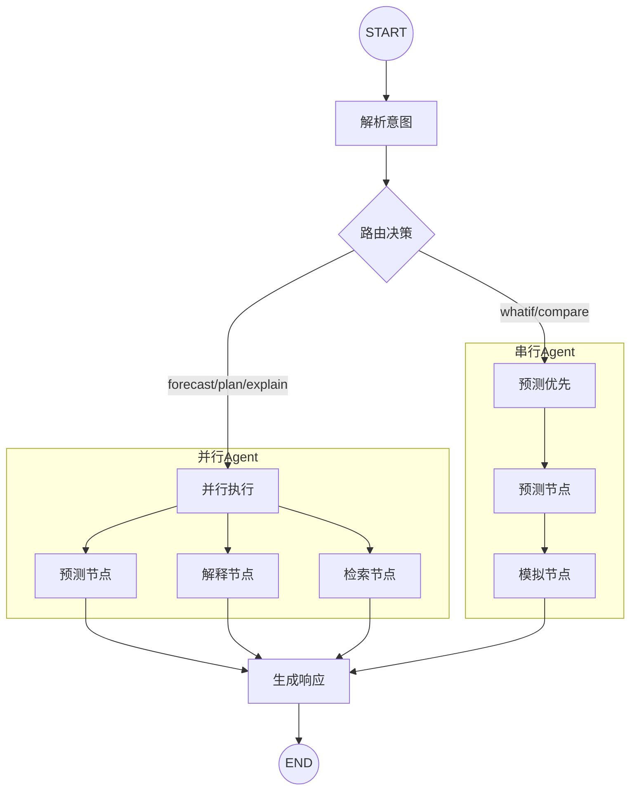

# AlpineFlow AI · Agent 层

> **Multi-Agent Traffic Intelligence System powered by LangGraph**

AlpineFlow AI 的智能体层，基于 LangGraph 构建的多智能体协同系统，为用户提供交通预测、出行规划、What-if 模拟和可解释 AI 能力。

---

## 目录

- [架构概览](#架构概览)
- [LangGraph 工作流](#langgraph-工作流)
- [快速开始](#快速开始)
- [核心功能](#核心功能)
- [API 接口](#api-接口)
- [代码结构](#代码结构)
- [扩展开发](#扩展开发)

---

## 架构概览

```
┌─────────────────────────────────────────────────────────────────┐
│                        用户请求 (API / Chat)                     │
└─────────────────────────────────────────────────────────────────┘
                                 │
                                 ▼
┌─────────────────────────────────────────────────────────────────┐
│                      LangGraph StateGraph                        │
│  ┌───────────┐    ┌──────────┐    ┌─────────────────────────┐   │
│  │parse_intent│ → │  route   │ → │    Agent Nodes          │   │
│  └───────────┘    └──────────┘    │  ├─ forecast_node      │   │
│                                    │  ├─ explain_node       │   │
│                                    │  ├─ retrieve_node      │   │
│                                    │  └─ simulate_node      │   │
│                                    └─────────────────────────┘   │
│                                               │                  │
│                                               ▼                  │
│                                    ┌─────────────────────┐       │
│                                    │  generate_response  │       │
│                                    └─────────────────────┘       │
└─────────────────────────────────────────────────────────────────┘
                                 │
                                 ▼
┌─────────────────────────────────────────────────────────────────┐
│                      个性化响应 + 可解释建议                      │
└─────────────────────────────────────────────────────────────────┘
```

### 核心组件

| 组件 | 说明 | 实现 |
|------|------|------|
| **StateGraph** | LangGraph 状态图，管理工作流 | `langgraph/graph.py` |
| **Agent Nodes** | 各专职 Agent 的处理逻辑 | `langgraph/nodes.py` |
| **Tools** | LLM 可调用的工具函数 | `langgraph/tools.py` |
| **LLM Agent** | 自然语言对话能力 | `langgraph/llm_agent.py` |
| **Graph RAG** | 知识图谱增强检索 | `graph_rag/` |

---

## LangGraph 工作流

### 状态定义 (State)

```python
class AgentState(TypedDict):
    query: str                    # 用户查询
    user_type: str                # 用户类型
    intent: str                   # 解析的意图
    date: str                     # 目标日期
    road: str                     # 高速公路
    forecast_result: Dict         # 预测结果
    explanation_result: Dict      # 解释结果
    retrieval_result: Dict        # 检索结果
    simulation_result: Dict       # 模拟结果
    final_response: Dict          # 最终响应
```

### 工作流图 (Graph)



### 节点说明

| 节点 | 功能 | 输入 → 输出 |
|------|------|------------|
| `parse_intent` | 解析用户意图 | query → intent |
| `route` | 路由决策 | intent → next_step |
| `forecast` | 交通预测 | date, site_id → predictions |
| `explain` | 因素分析 | date → factors, explanation |
| `retrieve` | 外部信息检索 | date, road → events, constructions |
| `simulate` | What-if 模拟 | scenario, forecast → simulation |
| `generate` | 响应生成 | all results → final_response |

---

## 快速开始

### 1. 安装依赖

```bash
pip install -r agent/requirements.txt
```

**依赖项：**
- `langgraph>=0.2.0` - 工作流框架
- `langchain-core>=0.3.0` - LangChain 核心
- `langchain-openai>=0.2.0` - OpenAI 集成（可选）
- `fastapi>=0.100.0` - API 框架
- `networkx>=3.0` - 图数据库

### 2. 基础使用

```python
from agent.langgraph import TrafficAgentGraph

# 创建 Agent
agent = TrafficAgentGraph()

# 交通预测
result = agent.invoke(
    query="What's the traffic like?",
    date="2026-07-15",
    road="A8",
    user_type="tourist"
)

print(result["forecast"]["predictions"])
```

### 3. 出行规划

```python
result = agent.invoke(
    query="Plan my trip from Munich to Salzburg",
    date="2026-08-01",
    user_type="tourist"
)

plan = result["plan"]
print(f"推荐出发: {plan['recommended_departure']}")
print(f"预计时长: {plan['estimated_travel_time_min']} 分钟")
```

### 4. What-if 模拟

```python
result = agent.invoke(
    query="What if it rains heavily?",
    date="2026-07-15",
    scenario={
        "type": "weather_change",
        "parameters": {"weather": "heavy_rain"}
    }
)

sim = result["simulation"]
print(f"预计延误: {sim['total_delay_minutes']} 分钟")
print(f"建议: {sim['recommendation']}")
```

### 5. LLM 对话模式

```python
from agent.langgraph.llm_agent import LLMTrafficAgent

# 需要设置: export OPENAI_API_KEY="your-key"
agent = LLMTrafficAgent(provider="openai")

# 多轮对话
response = agent.chat(
    "明天去萨尔茨堡，A8 会堵车吗？",
    date="2026-07-15",
    thread_id="user_123"  # 保持对话上下文
)
print(response)

# 继续对话
response = agent.chat(
    "那周六呢？",
    thread_id="user_123"
)
print(response)
```

### 6. 流式输出

```python
for event in agent.stream(query="Get forecast", date="2026-07-15"):
    for node_name, output in event.items():
        print(f"[{node_name}] completed")
```

### 7. 启动 API 服务

```bash
uvicorn agent.langgraph.api:create_app --factory --reload --port 8000
```

访问 `http://localhost:8000/docs` 查看 Swagger 文档。

---

## 核心功能

### 1. 交通预测 (Forecast)

预测指定日期、路段的小时级交通流量和拥堵等级。

**输出：**
- 小时级流量预测 (P10/P50/P90)
- 拥堵等级 (smooth/light/moderate/heavy/critical)
- 峰值小时识别
- 日度汇总统计

### 2. 因素解释 (Explain)

分析影响交通的因素，生成可解释的归因报告。

**分析因素：**
- 公共假期 (New Year, Christmas, etc.)
- 学校假期 (Summer Break, Easter Break, etc.)
- 周末效应 (Friday departure, Sunday return)
- 季节因素 (Summer tourist, Winter ski)
- 天气影响 (Rain, Snow)
- 路段瓶颈 (Rosenheim Junction)

### 3. 信息检索 (Retrieve)

实时获取外部信息。

**数据源：**
- 施工信息 (道路维护、车道关闭)
- 特殊活动 (Salzburg Festival, Oktoberfest)
- 实时事故/事件

### 4. What-if 模拟 (Simulate)

模拟不同场景下的交通状况。

**支持场景：**
- `weather_change` - 天气变化 (rain, snow, etc.)
- `traffic_increase` - 流量增加 (+20%, +50%)
- `accident` - 事故 (1-3 lanes blocked)
- `construction` - 施工影响

**输出：**
- 模拟后的速度/延误
- 替代方案建议
- 风险评估

### 5. 个性化服务

针对不同用户类型提供定制建议：

| 用户类型 | 关注点 | 建议重点 |
|---------|--------|---------|
| **Tourist** | 最佳出行体验 | 推荐出发时间、景点建议 |
| **Resident** | 避开拥堵 | 本地替代路线、通勤时段 |
| **Logistics** | 准时交付 | 货车限制、称重站信息 |
| **Tourism Business** | 客流预测 | 高峰到达时段、运营准备 |
| **Authority** | 交通管理 | 拥堵预防、资源调配 |

---

## API 接口

### 接口列表

| 接口 | 方法 | 说明 |
|------|------|------|
| `POST /api/query` | 通用查询 | 自然语言查询，自动路由 |
| `POST /api/forecast` | 交通预测 | 获取小时级预测 |
| `POST /api/plan` | 出行规划 | 生成出行计划 |
| `POST /api/whatif` | 场景模拟 | What-if 分析 |
| `POST /api/chat` | LLM 对话 | 自然语言交互 |
| `GET /api/calendar/{year}/{month}` | 月度日历 | 获取月度拥堵概览 |
| `GET /api/stream` | 流式输出 | SSE 实时返回 |
| `GET /api/graph` | 工作流图 | 获取 Mermaid 图定义 |

### 请求示例

```bash
# 通用查询
curl -X POST http://localhost:8000/api/query \
  -H "Content-Type: application/json" \
  -d '{
    "query": "What is the traffic like tomorrow?",
    "date": "2026-07-15",
    "road": "A8",
    "user_type": "tourist"
  }'

# What-if 模拟
curl -X POST http://localhost:8000/api/whatif \
  -H "Content-Type: application/json" \
  -d '{
    "date": "2026-07-15",
    "scenario_type": "weather_change",
    "parameters": {"weather": "heavy_rain"}
  }'

# LLM 对话
curl -X POST http://localhost:8000/api/chat \
  -H "Content-Type: application/json" \
  -d '{
    "message": "Should I drive to Salzburg this weekend?",
    "user_type": "tourist",
    "provider": "openai"
  }'
```

---

## 代码结构

```
agent/
├── __init__.py                  # 模块入口
├── README.md                    # 本文档
├── requirements.txt             # 依赖项
│
├── langgraph/                   # 🚀 LangGraph 实现 (推荐)
│   ├── __init__.py
│   ├── state.py                 # AgentState 状态定义
│   ├── nodes.py                 # 节点函数 (parse, forecast, explain, etc.)
│   ├── tools.py                 # LangChain Tools (5个工具)
│   ├── graph.py                 # StateGraph + TrafficAgentGraph
│   ├── llm_agent.py             # LLM 对话 Agent
│   ├── api.py                   # FastAPI 服务
│   └── example.py               # 使用示例
│
├── graph_rag/                   # 知识图谱
│   ├── __init__.py
│   ├── entities.py              # 节点/边定义 (7种节点类型)
│   ├── knowledge_graph.py       # 图存储 (NetworkX)
│   └── graph_rag.py             # GraphRAG 主类
│
├── agents/                      # Legacy Agent 实现
│   ├── forecast_agent.py
│   ├── explanation_agent.py
│   ├── retrieval_agent.py
│   └── simulation_agent.py
│
├── config.py                    # 配置管理
├── base.py                      # Agent 基类
├── orchestrator.py              # Legacy 调度器
└── api.py                       # Legacy API
```

---

## 扩展开发

### 添加新节点

在 `langgraph/nodes.py` 中添加新节点：

```python
def my_new_node(state: AgentState) -> Dict[str, Any]:
    """自定义节点"""
    # 从 state 读取输入
    date = state["date"]

    # 处理逻辑
    result = do_something(date)

    # 返回更新
    return {
        "my_result": result,
        "messages": [{"role": "system", "content": "Node completed"}]
    }
```

在 `langgraph/graph.py` 中注册：

```python
workflow.add_node("my_node", my_new_node)
workflow.add_edge("some_node", "my_node")
```

### 添加新工具

在 `langgraph/tools.py` 中添加：

```python
from langchain_core.tools import tool

@tool
def my_new_tool(param1: str, param2: int) -> Dict[str, Any]:
    """
    工具描述（LLM 会读取这个描述来决定何时调用）

    Args:
        param1: 参数1说明
        param2: 参数2说明

    Returns:
        结果字典
    """
    return {"result": "..."}

# 添加到工具列表
TRAFFIC_TOOLS.append(my_new_tool)
```

### 切换 LLM 提供商

```python
from agent.langgraph.llm_agent import LLMTrafficAgent

# OpenAI
agent = LLMTrafficAgent(provider="openai", model="gpt-4o")

# Anthropic
agent = LLMTrafficAgent(provider="anthropic", model="claude-sonnet-4-20250514")
```

### 自定义状态

扩展 `AgentState`：

```python
class ExtendedState(AgentState):
    custom_field: Optional[str]
    another_field: List[int]
```

---

## 与前端集成

### React 示例

```javascript
// api.js
const API_BASE = 'http://localhost:8000';

export async function getTrafficForecast(date, road) {
  const response = await fetch(`${API_BASE}/api/forecast`, {
    method: 'POST',
    headers: { 'Content-Type': 'application/json' },
    body: JSON.stringify({ date, road })
  });
  return response.json();
}

export async function planTrip(date, userType) {
  const response = await fetch(`${API_BASE}/api/plan`, {
    method: 'POST',
    headers: { 'Content-Type': 'application/json' },
    body: JSON.stringify({
      query: 'Plan my trip',
      date,
      user_type: userType
    })
  });
  return response.json();
}

// 流式输出
export function streamQuery(query, date, onEvent) {
  const url = new URL(`${API_BASE}/api/stream`);
  url.searchParams.set('query', query);
  url.searchParams.set('date', date);

  const eventSource = new EventSource(url);
  eventSource.onmessage = (e) => onEvent(JSON.parse(e.data));
  return () => eventSource.close();
}
```

### 使用示例

```javascript
// 获取预测
const forecast = await getTrafficForecast('2026-07-15', 'A8');
console.log(forecast.predictions);

// 出行规划
const plan = await planTrip('2026-08-01', 'tourist');
console.log(`推荐出发: ${plan.plan.recommended_departure}`);
```

---

## License

MIT License - AlpineFlow AI Team
