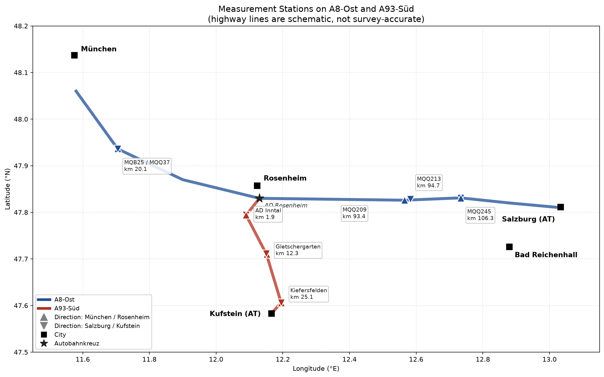

# 数据说明

本文合并了原先分散的数据总览、数据发现和传感器可靠性报告，只记录当前仓库中实际存在的数据。

## 1. 数据层级

```text
data/             主办方原始数据，约 4.3 GB
external/         天气、施工、节假日等外部数据快照
construction/     Autobahn 官网与 Wayback 施工历史资料
data_autobahn/    模型和 Agent 使用的标准化表
predictions/      辅助/旧版预测输出
doc/material/     挑战说明 PDF
```

模型的主要输入是 `data_autobahn/`，原始复核应回到 `data/`。

## 2. 原始数据 `data/`

### 2.1 交通测站

研究对象为 A8 East 和 A93 South 的 6 个物理测量点、双向共 12 条站点序列。

| DAUZ 编号 | 物理位置 | 道路 | 公里桩 | 方向 |
|---|---|---|---:|---|
| 9171 | MQB25 / MQQ37 | A8 | 约 20 | Mch / Sbg |
| 9192 | MQQ209 / MQQ213 | A8 | 约 93–95 | Mch / Sbg |
| 9194 | MQQ245 | A8 | 106 | Mch / Sbg |
| 9190 | AD Inntal | A93 | 1.9 | Ro / Kff |
| 9629 | Gletschergarten | A93 | 12.4 | Ro / Kff |
| 9191 | Kiefersfelden | A93 | 25.0 | Ro / Kff |

方向代码：

| 代码 | 含义 |
|---|---|
| `Mch` | 朝 München |
| `Sbg` | 朝 Salzburg |
| `Ro` | 朝 Rosenheim |
| `Kff` | 朝 Kiefersfelden / Kufstein |



### 2.2 1 分钟交通数据

目录：`data/2023-2025_1min_2+0_v/`

- 12 个 CSV。
- 时间范围：2023-01-01 至 2025-12-31。
- 分隔符：`;`。
- 主要字段：

| 字段 | 说明 |
|---|---|
| `devices` | 测站和检测器 ID |
| `datum` | 日期，`DD.MM.YYYY` |
| `t_start` | 分钟起始时刻 |
| `wochentag` | 星期，1=周一，7=周日 |
| `q_kfz` | 每分钟机动车总数 |
| `q_lkw` | 每分钟 Lkw-ähnlich 车辆数 |
| `q_pkw` | 每分钟 Pkw-ähnlich 车辆数 |
| `v_kfz` | 该分钟平均车速，km/h |

`Definition_Verhicle_Classes.png` 给出 TLS 车型分类。`q_lkw` 与小时表中的 `sv_h` 口径接近但并不完全等同，不应直接当作同一字段。

### 2.3 1 小时交通数据

目录：`data/DAUZ_2+0_1h_2023-2026/`

- 12 个 CSV，每个 26,304 条数据行。
- 时间范围实际为 2023-01-01 至 2025-12-31。
- 主要字段：

| 字段 | 说明 |
|---|---|
| `kfz_h` | 每小时机动车总流量，辆/小时 |
| `sv_h` | 每小时 Schwerverkehr 重型车流量，辆/小时 |
| `tagestyp` | `w` 工作日、`s` 周日/公共假日、`u` 假期出行日 |

`sv_h` 是流量，不是速度。速度来自 1 分钟数据聚合后的 `v_kfz`。

### 2.4 气温与路温

目录：`data/AirTemp_SurfaceTemp/`

- AD Rosenheim B15n、A8 km 54.6、Salzburg 方向。
- LT 为气温，FBT 为路面温度。
- 2023、2024、2025 分年保存，时间戳约为分钟级。
- 位置文件列出 13 类可用传感器，但仓库中只有 LT 和 FBT 时序。

数据行数显示存在时间缺口：

| 年份 | LT 数据行 | FBT 数据行 | 结论 |
|---|---:|---:|---|
| 2023 | 519,023 | 519,023 | 约缺 4.6 天 |
| 2024 | 500,561 | 500,561 | 约缺 18.4 天 |
| 2025 | 524,766 | 524,755 | 少量缺口，两个传感器末尾略有差异 |

历史分析得到 LT–FBT 相关系数约 0.93。模型仍保留两者的小时气候画像，但应注意共线性。

### 2.5 Consyst 拥堵图

仓库包含 A8 的每日拥堵时空图：

| 目录 | 图片数 |
|---|---:|
| `2023_ConsystPlots_A8(1)` | 708 |
| `2023_ConsystPlots_A8(2)` | 736 |
| `2024_ConsystPlots_A8(1)` | 724 |
| `2024_ConsystPlots_A8(2)` | 728 |
| `2025_ConsystPlots_A8` | 1,372 |

这些 PNG 可用于 A8 拥堵事件复核，但当前 CatBoost 交付模型没有直接从图片提取监督标签。

## 3. 标准化数据 `data_autobahn/`

除 `forecast_2026_2029.csv` 外，本目录 CSV 使用 `;` 分隔，第二行是中文字段说明。读取时需要跳过第二行：

```python
pd.read_csv(path, sep=";", skiprows=[1])
```

### 3.1 历史小时主表

`合并表格，小时交通流量.csv`

- 315,648 条有效数据行，即 12 站 × 1,096 天 × 24 小时。
- 覆盖 2023–2025 的完整小时网格。
- `kfz_h` / `sv_h` 各有 31,985 个缺失值，约 10.13%。
- `v_kfz` 有 24,992 个缺失值，约 7.92%。
- 有效范围：`kfz_h` 0–6,941，`sv_h` 0–1,034，`v_kfz` 5–158 km/h。

`tagestyp` 分布：

| 值 | 行数 | 占比 |
|---|---:|---:|
| `w` | 194,112 | 61.5% |
| `s` | 56,160 | 17.8% |
| `u` | 65,376 | 20.7% |

### 3.2 温度主表

`合并表格，时间，气温，路温.csv`

- 字段：`t_start;lt;fbt`。
- 约 154 万行。
- 用于构造小时温度和未来 day-of-year × hour 气候画像。

### 3.3 日级条件表

以下四张表均覆盖 2023-01-01 至 2029-12-31，共 2,557 个有效日期行：

| 文件 | 内容 |
|---|---|
| `合并表格，holiday日级.csv` | 拜仁、萨尔茨堡、蒂罗尔公共/学校假期及交通窗口 |
| `合并表格，weather日级.csv` | 历史观测天气和未来气候态 |
| `合并表格，construction日级.csv` | 施工、封道、2+0、关闭车道等特征 |
| `合并表格，special_events日级.csv` | München、Salzburg、Rosenheim、Kufstein 活动特征 |

未来天气不是天气预报，而是历史同期气候态。2027–2029 未知施工也不能被解释成“确认无施工”。

### 3.4 交付预测表

`forecast_2026_2029.csv`

- CSV 使用逗号分隔，没有中文说明行。
- 420,768 行：12 站 × 1,461 天 × 24 小时。
- 日期范围：2026-01-01 至 2029-12-31。
- 主键 `(site_id, date, hour)` 无重复。
- 已检查 P10 ≤ P50 ≤ P90，无分位数交叉。

字段：

| 字段 | 说明 |
|---|---|
| `site_id` | `road_direction_site_name` |
| `road` | `A8` / `A93` |
| `direction` | `Mch` / `Sbg` / `Ro` / `Kff` |
| `site_name` | 测站名称 |
| `date`, `hour` | 日期和小时 |
| `kfz_h_p10/p50/p90` | 总流量分位数预测 |
| `sv_h_pred` | 重型车流量预测 |
| `v_kfz_pred` | 平均车速预测 |
| `interval_width` | `p90 - p10` |
| `relative_interval_width` | `interval_width / (p50 + 1)` |

Agent 既可以直接读取 `relative_interval_width`，也可以用 P10/P50/P90 重新计算。

## 4. 外部数据

### `external/`

- `weather_daily.parquet`：2018–2025 日天气。
- `weather_climatology.parquet`：366 个 day-of-year 气候态。
- `construction_sites_clean.csv`：清洗后的当前/计划施工。
- `construction_daily.parquet`：日期 × 走廊施工特征。
- `holidays/`：三个目标州 2023–2029 节假日、覆盖信息和交通窗口。

详见 `external/README.md` 和 `external/holidays/README.md`。

### `construction/`

保存 Autobahn GmbH 当前官网和 Internet Archive 的 A8/A93 项目、状态观察、历史事件和候选 URL。它是施工证据库，不等同于实时封路 API。

详见 `construction/README.md`。

### 施工表修正状态

`data_autobahn/合并表格，construction日级.csv` 已使用严格的 2+0 判定和目标走廊过滤重建。当前统计：

| 时段 | 有施工天数 | 2+0 天数 | 解释 |
|---|---:|---:|---|
| 2023–2024 | 0 / 731 | 0 | 实时 API 不提供历史档案 |
| 2025 | 128 / 365 | 0 | A8 近期开工记录 |
| 2026–2029 | 549 / 1,461 | 224 | 已发布的近期/计划施工 |

此前曾有一版数据把约 91.5% 的未来日期误判为 2+0；当前修正版为约 15.3%。需要注意：

- 2023–2024 的 0 表示数据源缺历史，不证明当年没有施工。
- 2028–2029 大量 0 表示计划尚未发布，不证明未来没有施工。
- `external/construction_daily.parquet` 是按日期 × 道路的精简表，`data_autobahn` CSV 是模型需要的一日一行宽表。
- 仓库中没有旧文档提到的 `scripts/fix_construction_data.py` 或 `scripts/rebuild_construction_csv.py`；当前可复现的施工采集入口是 `construction/collect_construction.py`，但其输出是 Wayback 证据库，不会直接重建模型施工特征。

## 5. 数据质量结论

原有两份传感器可靠性报告的共同结论已合并如下：

- 12 个 1 分钟站点中，10 个总体完整率高于约 97%。
- Gletschergarten 双方向在 2023 年无数据，2024 年 1 月部分上线，2024 年 2 月后通常高于 95%。
- Kiefersfelden Kff 方向在 2023 年 7–12 月有明显故障，2024 年后恢复。
- 2024-02 至 2025-12 是全部 12 站最一致的观测窗口。
- DE1,2 与 DE33,34 本身没有系统性的可靠性差异，主要问题来自少数具体站点。
- 历史原始 `v_kfz` 曾出现约 250 km/h 的异常值；标准化小时表已将有效上限控制在 158 km/h。
- 阿尔卑斯走廊不是普通通勤路：周末和假期的午间峰值非常重要，`tagestyp × hour` 是核心特征。

## 6. 使用建议

- 快速建模：使用 `data_autobahn/合并表格，小时交通流量.csv`。
- 复核分钟曲线和传感器缺测：使用 `data/2023-2025_1min_2+0_v/`。
- Agent 查询：使用 `data_autobahn/forecast_2026_2029.csv` 和四张日级条件表。
- 不要把未来气候态当作真实天气预报。
- 不要把 Wayback 缺少记录解释为当时没有施工。
- 不要将前端 Demo 颜色当作模型预测；当前前端尚未接入这些数据。
