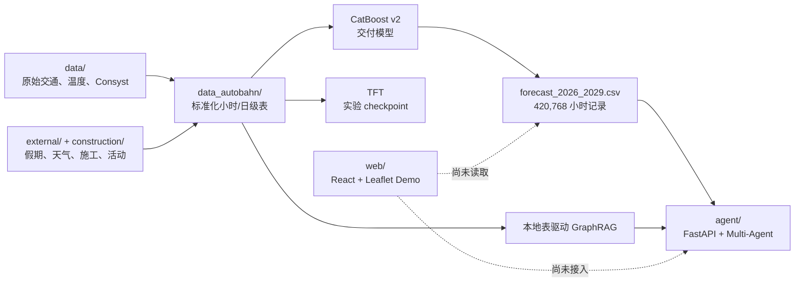
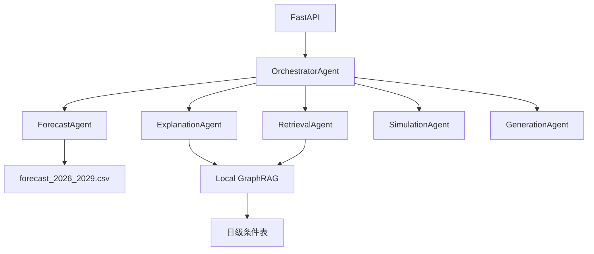

# AlpineFlow 系统与产品现状

AlpineFlow 面向 A8 East 与 A93 South 度假走廊，把长期交通预测转化为可查询、可解释、可规划的交通决策信息。

本文只描述仓库在 **2026-06-20** 的真实状态，并将已实现能力与产品规划分开。

## 1. 当前结论

```text
已完成：
历史与外部数据整理
→ CatBoost 2026–2029 小时预测
→ 本地 GraphRAG 与多 Agent API
→ 日历/地图 Web Demo

尚未完成：
Web 读取真实预测
Web 调用 Agent API
实时交通/事故联网
CatBoost 与 TFT 融合
通知、反馈、计划持久化
```

## 2. 实际架构



最重要的实现边界：

- CatBoost 是当前交付预测引擎。
- TFT 是独立实验，不在交付链路中。
- GraphRAG 是本地表构成的虚拟图，不是 Neo4j。
- Agent 不在请求时重新训练模型，而是查询已生成预测。
- Web 当前使用 `trafficData.js` 的确定性规则生成 Demo 颜色。

## 3. 仓库结构

```text
.
├── data/                 原始挑战数据
├── external/             外部天气、施工、节假日快照
├── construction/         官网与 Wayback 施工资料
├── data_autobahn/        标准化表和交付预测
├── model/                CatBoost / TFT notebooks
├── models/               CatBoost 模型和 TFT checkpoint
├── predictions/          辅助预测输出
├── agent/                Agent、GraphRAG、FastAPI
├── web/                  React/Vite/Leaflet Demo
└── doc/                  当前整合文档
```

## 4. 数据与模型层

模型输入包括：

- 2023–2025、12 个方向站点的小时交通流量。
- 三州公共假期、学校假期和出发/返程窗口。
- 历史天气及 2026–2029 气候态。
- 施工、2+0、关闭车道等日级特征。
- München、Salzburg、Rosenheim、Kufstein 的活动特征。

CatBoost 输出：

- 总流量 P10 / P50 / P90。
- 重型车流量。
- 平均车速。
- 预测区间宽度。

详见 [DATA.md](DATA.md) 和 [MODEL.md](MODEL.md)。

## 5. Agent 层

主入口：`agent/tools/api_app.py`



### 5.1 已实现能力

| 组件 | 当前行为 |
|---|---|
| `ForecastAgent` | 按日期懒加载交付预测，输出小时分位数、速度、峰值和日汇总 |
| `ExplanationAgent` | 用日期规则、预测和 GraphRAG 因素生成解释 |
| `RetrievalAgent` | 查询本地 GraphRAG，并混合少量代码内置施工/活动样例 |
| `SimulationAgent` | 对天气、流量、事故、施工等场景做规则型 what-if 调整 |
| `GenerationAgent` | 将结构化结果整理成摘要、发现和建议 |
| `GraphRAG` | 对 Site、Road、Forecast、Factor 提供受限只读 Cypher-like 查询 |
| `langgraph/` | 可选工作流与 LLM tool-calling 实现，不是主 API 必需路径 |

### 5.2 不是实时联网服务

尽管部分类名和注释写有“联网搜索”，当前 `RetrievalAgent` 没有调用真实 Autobahn、事故或活动 API：

- 施工和活动主体来自本地表。
- 代码中还有少量 Mock 样例。
- incidents 当前返回空列表。
- `OPENAI_API_KEY` 只影响可选 LLM 路径；主 `GenerationAgent` 是规则化结构生成。

因此演示时应称为“本地数据驱动的决策 Agent”，不应称为实时交通监控。

### 5.3 主 API

启动：

```bash
python3 -m venv .venv
source .venv/bin/activate
pip install -r requirements.txt
pip install -r agent/requirements.txt
uvicorn agent.tools.api_app:create_app --factory --reload --port 8000
```

主要端点：

| 方法 | 路径 | 用途 |
|---|---|---|
| GET | `/` | 服务信息 |
| GET | `/health` | Agent 健康状态 |
| POST | `/api/forecast` | 小时级预测 |
| POST | `/api/plan` | 个性化出行计划 |
| POST | `/api/whatif` | 场景模拟 |
| POST | `/api/chat` | 自然语言意图路由 |
| GET | `/api/calendar/{year}/{month}` | 月度日历汇总 |
| GET | `/api/graph/stats` | 图统计 |
| POST | `/api/graph/query` | 受限只读 Cypher-like 查询 |
| GET | `/api/graph/factors` | 日期/路段影响因素 |
| GET | `/api/graph/explain` | 拥堵解释 |

预测示例：

```bash
curl -X POST http://localhost:8000/api/forecast \
  -H 'Content-Type: application/json' \
  -d '{
    "date": "2026-07-18",
    "road": "A8",
    "site_id": "A8_Sbg_MQQ245_Sbg_H",
    "direction": "Sbg",
    "hours": [6, 7, 8, 9, 10]
  }'
```

## 6. Web 前端

技术栈：

- React 19
- Vite 6
- Leaflet / OpenStreetMap
- Hash 路由

启动：

```bash
cd web
npm install
npm run dev
```

构建：

```bash
cd web
npm run build
```

当前页面：

| 页面/组件 | 已实现 |
|---|---|
| Calendar | 2023–2029 月历、A8/A93、双方向、24 小时抽屉 |
| Map | A8/A93 分段地图、方向/日期/小时选择、线路颜色 |
| AgentBot | 可拖动头像、五类角色、欢迎文案和本地偏好保存 |

当前限制：

- `CalendarPage` 和 `MapPage` 调用 `web/src/lib/trafficData.js`。
- 交通状态由日期、小时、方向和字符串 seed 计算，不是模型输出。
- 页面没有 `fetch`/Axios 请求。
- AgentBot 输入框被禁用，并显示“Full agent capabilities will be connected here next”。
- 地图线路是手工坐标段，不是测站级预测插值。

## 7. 产品能力：现状与规划

| 产品能力 | 状态 | 当前实现 |
|---|---|---|
| Traffic Calendar | Demo | 月历与双方向颜色已完成，数据仍是前端规则 |
| 24h Traffic Detail | Demo | 小时列表已完成，数据仍是前端规则 |
| Segment Map | Demo | 交互地图已完成，颜色仍是前端规则 |
| Explainable AI | 后端已实现 | Agent API 可返回规则和 GraphRAG 解释，前端未展示 |
| Personalized Assistant | 后端部分实现 | 五类用户和计划逻辑存在，聊天 UI 未接线 |
| What-if Digital Twin | 规则模拟 | 后端可调整预测并生成替代建议，不是微观交通仿真 |
| Smart Alert | 规划中 | 无通知调度、订阅或持久化 |
| Plan 保存 | 规划中 | 无数据库和用户账户 |
| 用户反馈学习 | 规划中 | 无反馈接口和在线学习 |
| Crowd Forecast | 概念 | 无用户计划采集或群体统计 |

五类用户画像仍然适合作为产品组织方式：

- Traveler：最佳出发日期和时间。
- Resident：避开本地峰值。
- Logistics：提高到达时间可靠性。
- Tourism：准备游客到达高峰。
- Authority：关注走廊风险和干预窗口。

## 8. 推荐的最短联调路径

下一步不需要继续扩写产品功能，先打通一条真实数据链：

1. 给 Web 增加 API client。
2. Calendar 调用 `/api/calendar/{year}/{month}`。
3. 选中日期后调用 `/api/forecast`。
4. 将 API 的站点/小时预测映射为 `smooth / busy / heavy`。
5. AgentBot 启用输入并调用 `/api/chat`。
6. UI 明确显示数据来源：真实预测、气候态、施工快照或规则模拟。

完成这六步后，项目才形成真正的：

```text
数据 → 模型 → Agent → 前端
```

端到端闭环。

## 9. 校验状态

本次文档整理时已执行：

- `npm run build`：通过。
- `python3 -m compileall -q agent`：通过。
- `agent.tools.api_app` 直接导入：当前裸环境缺少 `numpy`，安装根目录和 `agent/requirements.txt` 后才能启动。
- 交付预测行数、日期范围、主键和分位数顺序检查：通过。
