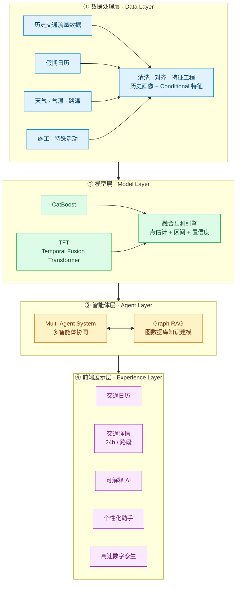
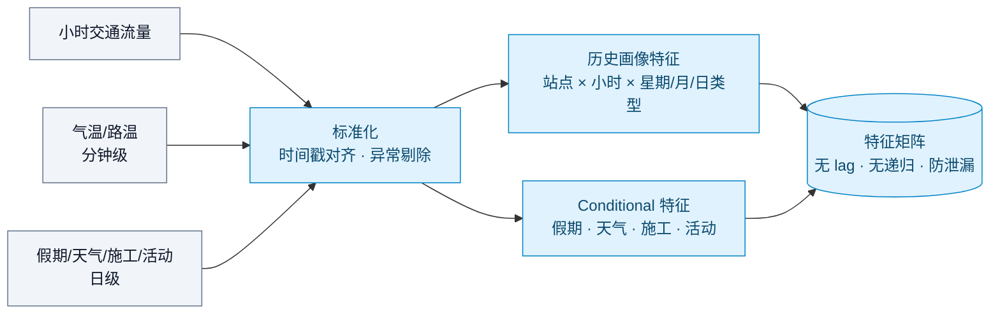
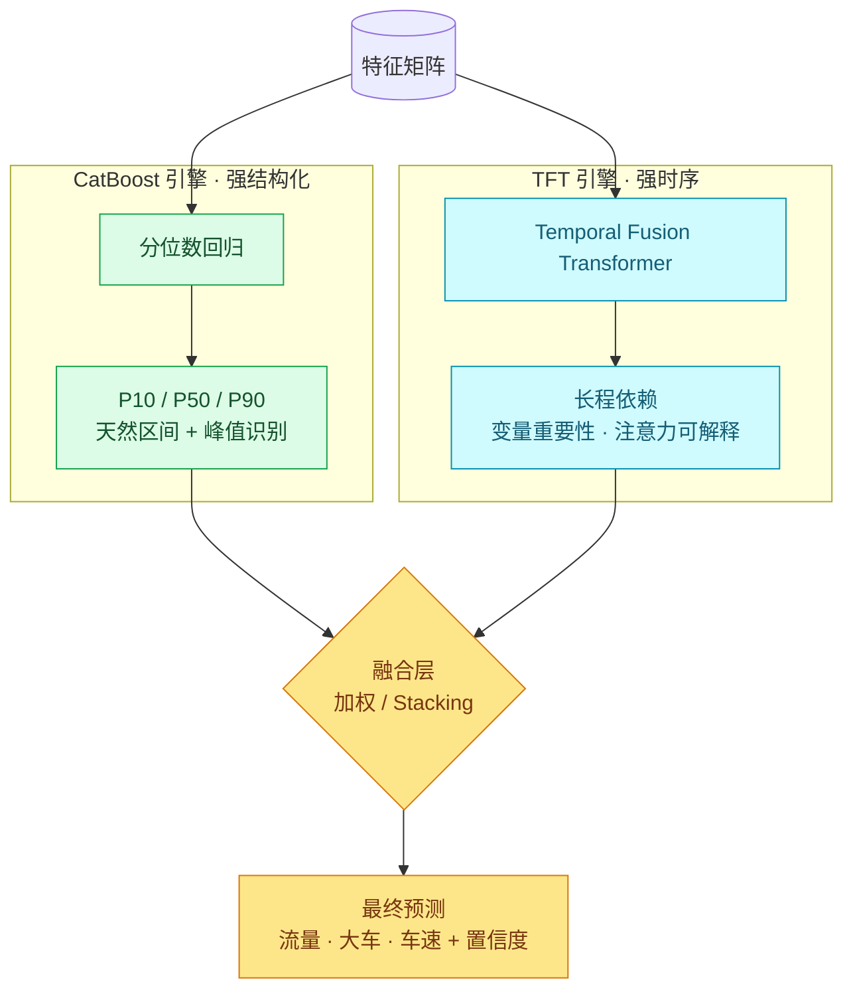
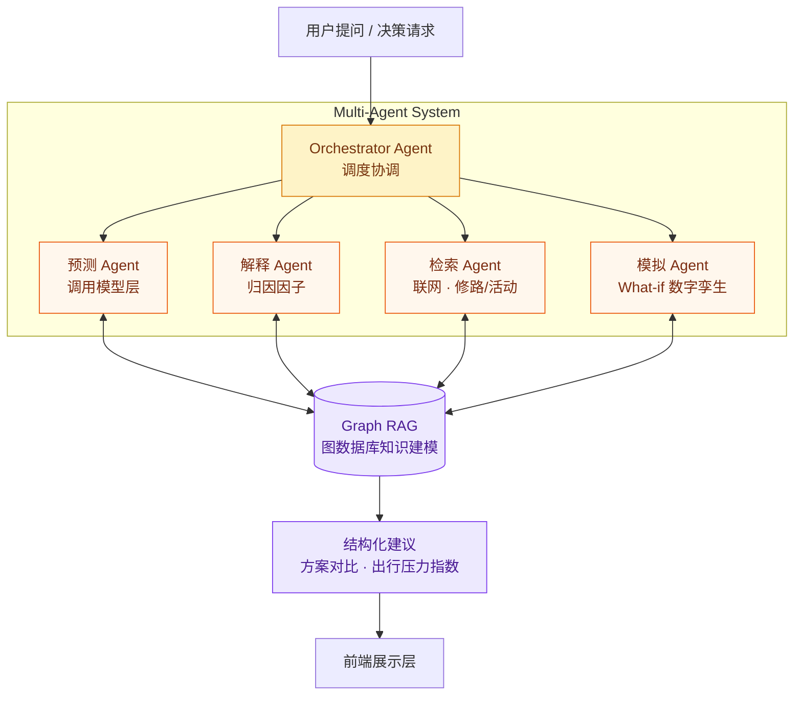
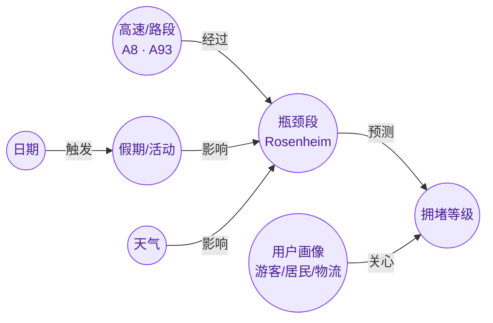
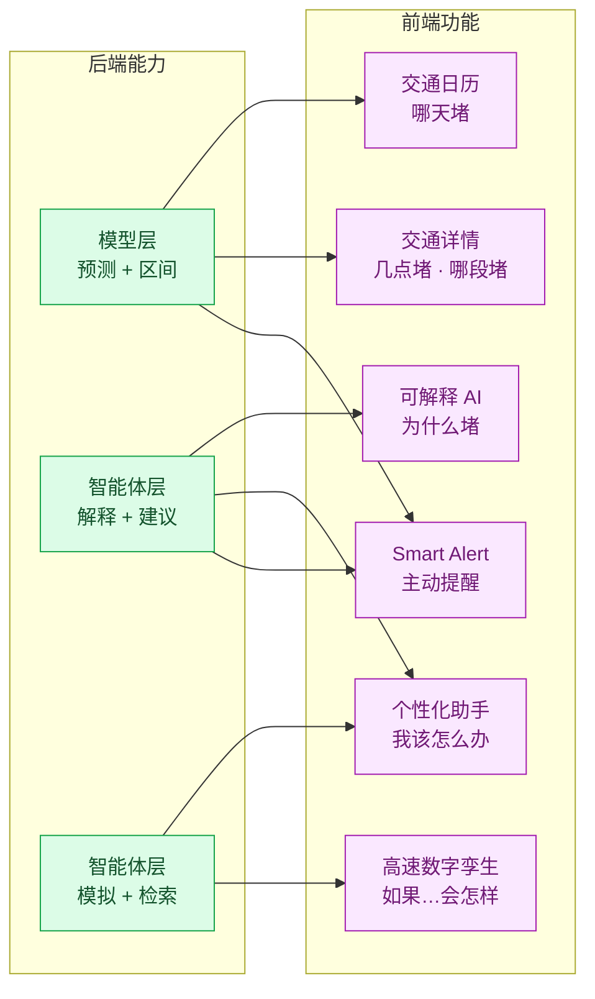
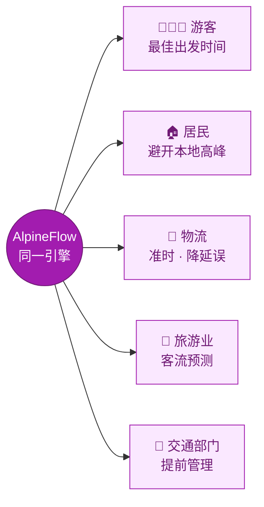

# AlpineFlow AI · 项目架构与产品方案

> **从交通预测（Traffic Forecast）到交通决策（Traffic Decision）**
> 一套贯穿「数据 → 模型 → 智能体 → 体验」的端到端 Autobahn 交通智能平台。

### 我们的目标

1. **Human Mobility Intelligence** — 理解人「为什么出行」，预测未来需求。
2. **Traffic Digital Twin** — 用数字孪生模拟「将会发生什么」，提前测试方案。
3. **Multi-Agent Optimization** — 让 AI 决策「每个人该怎么走」，优化整个交通生态。

---

## 一、四层架构总览

整个系统由四层纵向贯通，每一层都为上层提供能力，最终在前端转化为不同用户的决策。

---

## 二、数据处理层 · Data Layer

把多源、异构、不同时间粒度的原始数据，凝练成模型可直接消费的特征。

- **历史画像**：把 2023–2025 主流量凝练成「典型画像」，作为预测基线。
- **Conditional 偏移**：假期 / 天气 / 施工 / 活动只负责在基线上做修正，可解释、可归因。

---

## 三、模型层 · Model Layer（CatBoost × TFT 双引擎）

我们采用：**梯度提升树 + 时序 Transformer 双引擎融合**，兼顾结构化特征表达与长程时序依赖。

| 引擎 | 擅长 | 产出 |
|---|---|---|
| **CatBoost** | 类别特征、稀疏事件、分位区间 | P10/P50/P90 预测 + 峰值小时识别 |
| **TFT** | 长程时序、多变量注意力 | 时序趋势 + 变量级可解释性 |
| **融合层** | 取长补短 | 更稳的点估计 + 更可靠的不确定性 |

> 双引擎不仅提升精度，更同时提供「**区间**（CatBoost）」与「**注意力归因**（TFT）」，为上层可解释 AI 打下基础。

---

## 四、智能体层 · Agent Layer（Multi-Agent × Graph RAG）

**多智能体系统**协同决策，并用**图数据库（Graph RAG）**把道路—事件—预测—用户建模成知识图谱，让 AI 智能体从现实数据中学习高速流量规律。

**Graph RAG 知识建模**——把交通世界建成一张可推理的图：

- **Multi-Agent**：调度、预测、解释、检索、模拟各司其职，协同生成「带理由」的方案。
- **Graph RAG**：用图关系沉淀「为什么堵 / 哪里堵 / 谁受影响」，让建议可追溯、可解释。

---

## 五、前端展示层 · 与架构绑定

前端不是孤立 UI——**每个产品功能都直接用到了某一层的能力**，形成架构 → 体验的强绑定。

**五类用户，同一架构，不同决策**：

### 产品功能

**1. Traffic Calendar（交通日历）** — 回答：哪天会堵？
- 选择高速、方向、日期
- 日历颜色显示未来拥堵风险：🟢 Smooth → 🔴 Critical

**2. Traffic Detail（交通详情）** — 回答：什么时候堵？哪里堵？
- **Daily Forecast**：当天拥堵等级 / 预计车流量 / 预测可信度
- **24h Traffic Prediction**：每小时拥堵情况 / 最堵时间 / 推荐出发时间
- **Segment Map**：显示高速不同路段拥堵，定位瓶颈区域

**3. Explainable AI（AI 解释）** — 回答：为什么堵？
- 分析影响因素：假期影响 / 周末出行 / 历史相似日期
- 让预测可信

**4. Personalized Assistant（AI Agent）** — 回答：我该怎么办？
- 预测模型 + 联网搜索（是否有修路、活动计划）
- 针对不同用户生成建议 + 出行方案对比 + 出行压力指数：
  - 👨‍👩‍👧 Traveler → 推荐最佳出发日期和时间
  - 🏠 Resident → 避免本地交通影响
  - 🚚 Logistics → 优化运输时间，降低延误
  - 🏨 Tourism → 预测游客高峰，调整运营
  - 🚦 Authority → 提前制定交通管理措施，提前发布建议
- Plan 要完整：写从慕尼黑出发开始算的预测时间
- 可以保存 Plan，并添加 Traffic Impact Notification：若之后天气或其他因素影响，自动生成新的 Plan

**5. 高速数字孪生（AI Traffic Digital Twin + What-if Simulation）** — 实时模拟未来交通状况
- 用户直接提问，例如「如果明天下雨还能出行吗」
- AI 给出：是否推荐 / 原因及交通模拟图 / 替代方案

**6. Smart Alert** — 主动提醒
- 更好的出行窗口 / 延误风险变化 / 高风险交通日

**7. 反馈**
- 出行后可对当天交通状况进行评价和评分，模型根据置信度实时调整

---

### 未来规划（Future Plan）

**1. AI Traffic Digital Twin（高速数字孪生）** — 更偏技术创新
- 创建一个 A8 虚拟高速：`Real A8 → AI Model → Virtual A8`
- 模拟：`+20% tourists` / `+heavy rain` / `+accident`
- 结果：`Rosenheim bottleneck appears at 09:30，Queue length: 8 km`
- 适合：Traffic Authority、Hackathon pitch

**2. Traffic Memory（个人交通记忆）** — AI 学习用户习惯
- 以前：`You always drive Munich → Salzburg, Friday evening`
- 未来主动：`Your usual trip next Friday will face +45min delay. Leave 2h earlier?`

**3. Traffic Crowd Forecast（别人什么时候走）** — 用户心理：大家几点出发？我错开。
- 显示：`People like you：45% leave 08:00–10:00 🔴 / 15% leave before 06:00 🟢`
- 然后：`Beat the crowd：Leave 05:45`
- 社区：用户上传计划出行时间，统计后供他人参考，错峰出行

---
